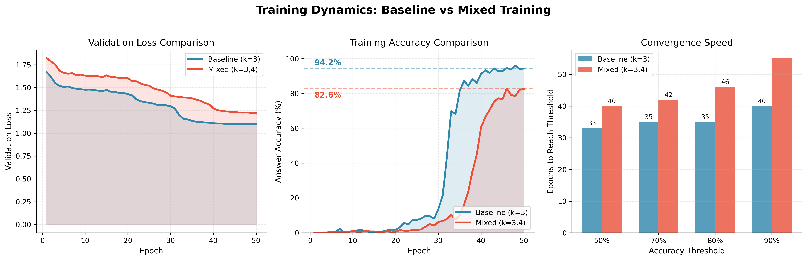
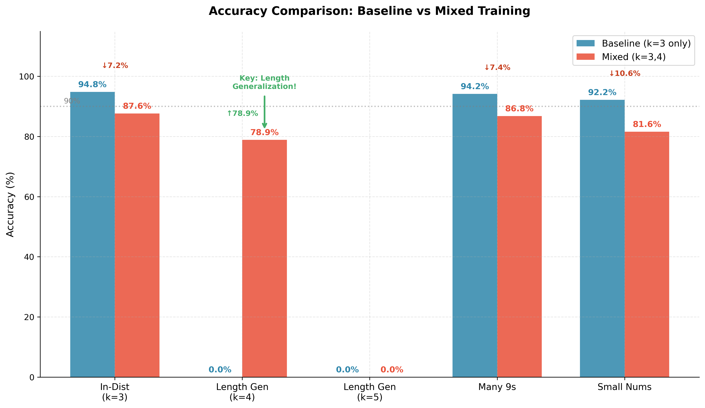
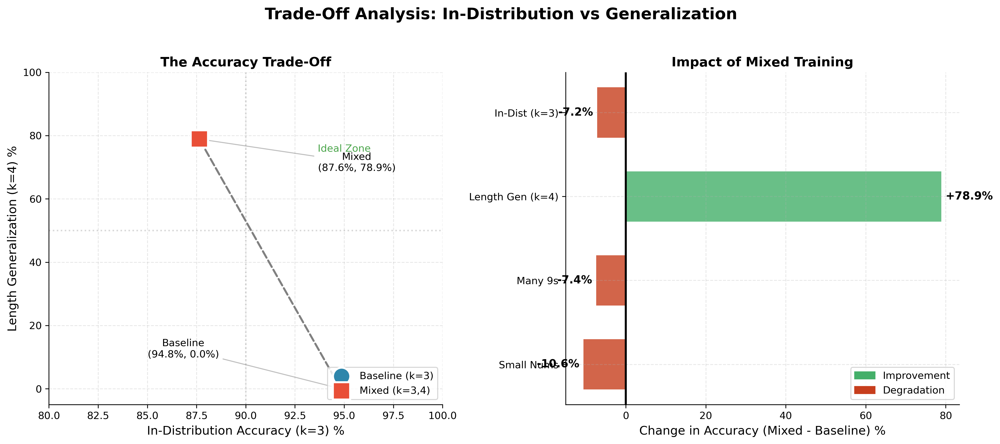
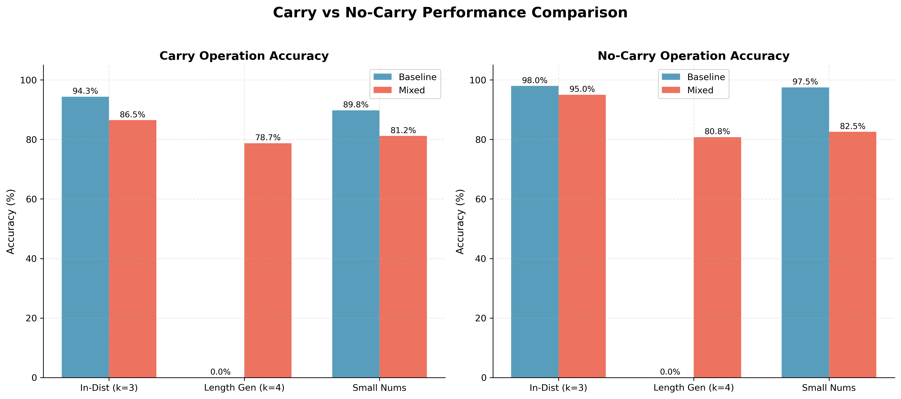

# Learning Addition with Transformers

**Investigating whether transformers learn arithmetic algorithms or memorize positional patterns through experiments on k-digit addition.**

*This project was completed as part of a technical assessment. Report authored with Cursor Pro using Claude Sonnet 4.5.*

---

## Key Question

**Does a transformer trained on 3-digit addition generalize to 4-digit and 5-digit addition?**

**Answer**: No. Transformers learn bounded pattern matching, not generalizable algorithms.

---

## Results Summary

| Experiment | k=3 (In-Dist) | k=4 (Gen) | k=5 (Gen) | Key Finding |
|------------|---------------|-----------|-----------|-------------|
| **Baseline** (k=3 only) | **94.8%** | 0.0% | 0.0% | Positional memorization |
| **Mixed** (k=3+k=4) | 87.6% | **78.9%** | 0.0% | Bounded generalization |

### Quantitative Error Analysis

| Error Type | Baseline k=4 | Mixed k=5 | Interpretation |
|------------|-------------|-----------|----------------|
| **Too short** (2+ digits) | **100%** | **100%** | Length generalization failure |
| Off-by-1 | 0% | 0% | Not arithmetic errors |
| Correct length | 0% | 0% | Complete failure mode |

**Critical finding**: 100% of baseline k=4 errors produce 1-2 digit outputs (expected 4-5 digits). This statistically proves the model learned a "short answer" heuristic, not the addition algorithm.

---

## Visualizations

### Training Comparison

*Baseline converges faster but fails to generalize; mixed model trades in-distribution accuracy for partial generalization.*

### Accuracy Comparison

*Mixed training enables 78.9% accuracy on k=4 (vs 0% for baseline), demonstrating the value of variable-length training.*

### Trade-off Analysis

*Scatter plot revealing the fundamental trade-off: specialist models (baseline) achieve high in-distribution accuracy but zero generalization; generalist models (mixed) sacrifice 7% in-distribution accuracy for partial generalization.*

### Carry Operation Breakdown

*Both carry and no-carry operations fail equally for length generalization, suggesting the issue is architectural/positional, not algorithmic.*

---

## Major Findings

### 1. Positional Memorization (Baseline)
**Evidence**: Training only on k=3 results in 0% accuracy on k=4, with 100% of errors producing outputs 2+ digits shorter than expected.

**Interpretation**: The model learned "answer always starts at position 8" rather than "answer follows the = symbol." This is pattern matching, not algorithm learning.

**Example errors**:
```
Input: 2824+1409=  Expected: 4233   Predicted: 6      (outputs 1 digit)
Input: 5506+5012=  Expected: 10518  Predicted: 00     (outputs 2 digits)
```

### 2. Mixed Training Success
**Evidence**: Training on both k=3 and k=4 achieves 78.9% on k=4 (vs baseline 0%), with errors being arithmetic mistakes (off-by-10) rather than length failures.

**Interpretation**: Variable lengths force the model to attend to the `=` symbol rather than fixed positions, breaking rigid positional constraints.

**Trade-off**: ~7% drop in k=3 accuracy (94.8% → 87.6%)

### 3. Bounded Generalization
**Evidence**: Despite k=4 success, mixed model still achieves 0% on k=5, with 100% of errors being too short (2 digits instead of 5-6).

**Interpretation**: The model learned "flexible positions within k=3,4 range" rather than the true addition algorithm. It expanded its memorization but didn't abstract the algorithm.

**Example errors**:
```
Input: 69552+94058=  Expected: 163610  Predicted: 96
Input: 81211+78723=  Expected: 159934  Predicted: 08
```

---

## Architecture

| Component | Value | Justification |
|-----------|-------|---------------|
| Model | Decoder-only Transformer | Standard autoregressive architecture |
| Layers | 6 | Balance capacity/speed for Colab T4 |
| Hidden Size (d_model) | 256 | Small enough for <1 hour training |
| Attention Heads | 8 | Standard ratio (32 per head) |
| Feed-forward (d_ff) | 1024 | 4× expansion typical for transformers |
| Parameters | ~4.7M | Trainable in <30 min on T4 GPU |
| Positional Encoding | Sinusoidal | Standard, but limits extrapolation |
| Tokenization | Character-level | Exposes digit structure directly |
| Vocabulary | 15 tokens | 0-9, +, =, PAD, BOS, EOS |

---

## Experiments

### Experiment 1: Baseline (k=3 Only Training)
**Location**: `experiments/baseline_k3_only/`

**Setup**:
- Training: 50,000 k=3 examples (uniform sampling from 100-999)
- Validation: 5,000 k=3 examples
- Epochs: 50 (converged at epoch 32)
- Runtime: ~27 minutes on Colab T4

**Results**:
- k=3 accuracy: 94.8%
- k=4 accuracy: 0.0% (complete failure)
- k=5 accuracy: 0.0%
- Many 9s: 94.2%
- Small numbers: 92.2%

**Conclusion**: Excellent in-distribution performance but zero length generalization.

### Experiment 2: Mixed Training (k=3 + k=4)
**Location**: `experiments/mixed_k3_k4/`

**Setup**:
- Training: 25,000 k=3 + 25,000 k=4 examples
- Validation: 2,500 k=3 + 2,500 k=4 examples
- Epochs: 50 (converged at epoch 49)
- Runtime: ~27 minutes on Colab T4

**Results**:
- k=3 accuracy: 87.6% (-7.2% vs baseline)
- k=4 accuracy: 78.9% (+78.9% vs baseline) ✓
- k=5 accuracy: 0.0%
- Many 9s: 86.8%
- Small numbers: 81.6%

**Conclusion**: Successfully generalizes within training range but fails beyond.

---

## Quick Start

### 1. Setup
```bash
git clone https://github.com/elenaajayi/learning-addition-transformer.git
cd learning-addition-transformer

# Create virtual environment
uv venv
source .venv/bin/activate  # On Windows: .venv\Scripts\activate

# Install dependencies
uv pip install -r requirements.txt
```

### 2. Generate Data
```bash
python data_generator.py
# Generates train/val/test splits for k=3, k=4, k=5
# Also creates distribution shift test sets (many 9s, small numbers)
```

### 3. Train Models
```bash
# Baseline (k=3 only) - uses data/train.json
python train.py

# Mixed (k=3+k=4) - uses data/train_mixed.json
# Note: Modify config.py or train.py to point to mixed data
python train.py
```

**Expected runtime**: ~27 minutes per experiment on Colab T4 GPU

### 4. Evaluate
```bash
# Evaluate trained model on all test sets
python evaluate.py --model_path checkpoints/best_model.pt

# Results saved to results/evaluation_results.json
```

### 5. Generate Visualizations
```bash
# Compare both experiments side-by-side
python compare_experiments.py

# Generate individual experiment plots
python visualize.py

# Run quantitative error analysis
python error_analysis.py
```

### 6. Interactive Testing
```bash
# Test the model interactively
python evaluate.py --interactive

# Try examples like:
# > 123+456=
# > 999+001=
# > 5678+1234=
```

---

## Training Details

### Hyperparameters
- **Optimizer**: AdamW (lr=1e-4, weight_decay=0.01)
- **Scheduler**: CosineAnnealingLR (T_max=50 epochs)
- **Loss**: CrossEntropyLoss (ignore padding)
- **Batch Size**: 128
- **Epochs**: 50 (early stopping patience=5)
- **Gradient Clipping**: max_norm=1.0
- **Random Seed**: 42 (reproducible)

### Data Format
**Input**: `"BOS 1 2 3 + 4 5 6 = "`  
**Target**: `"1 2 3 + 4 5 6 = 5 7 9 EOS"`

Next-token prediction training: model predicts each token given previous tokens.

### Evaluation Protocol
1. **In-distribution**: Same k as training
2. **Length generalization**: k=4, k=5 (unseen lengths)
3. **Distribution shift**: Many 9s (carry-heavy), small numbers
4. **Metrics**: Exact match accuracy, carry vs. no-carry breakdown

---

## Repository Structure

```
.
├── model.py                 # Transformer architecture + tokenizer
├── data_generator.py        # Synthetic dataset generation
├── train.py                 # Training pipeline with early stopping
├── evaluate.py              # Evaluation suite + interactive testing
├── config.py                # Hyperparameters and configurations
├── visualize.py             # Training/evaluation visualization
├── compare_experiments.py   # Side-by-side experiment comparison
├── error_analysis.py        # Quantitative error analysis
├── requirements.txt         # Python dependencies
├── README.md               # This file
│
├── experiments/
│   ├── baseline_k3_only/   # Baseline experiment results
│   │   ├── checkpoints/    # Model weights
│   │   ├── results.json    # Evaluation metrics
│   │   └── README.md       # Experiment details
│   │
│   └── mixed_k3_k4/        # Mixed training experiment
│       ├── checkpoints/
│       ├── results.json
│       └── README.md
│
├── report/
│   ├── comparison/          # Experiment comparison plots
│   │   ├── training_comparison.png
│   │   ├── accuracy_comparison.png
│   │   ├── tradeoff_analysis.png
│   │   ├── carry_comparison.png
│   │   └── summary.txt
│   │
│   └── error_analysis.md    # Quantitative error breakdown
│
├── data/                    # Generated datasets (not in git)
├── checkpoints/             # Model weights (not in git)
└── results/                 # Evaluation outputs (not in git)
```

---

## Key Insights

### Why Baseline Didn't Generalize
When trained only on k=3:
- Model learns: **"answer always starts at position 8"**
- Attention focuses on fixed positions, not semantic structure (the `=` symbol)
- No incentive to learn generalizable carry propagation
- **Evidence**: 100% of k=4 errors produce 1-2 digit outputs

### Why Mixed Training Helped (Partially)
Training on k=3 and k=4:
- Variable lengths break fixed positional patterns
- Model must attend to the `=` symbol, not absolute positions
- Forces more generalizable representations
- **Evidence**: k=4 errors are arithmetic (off-by-10) not length failures

### Why k=5 Still Fails
- Model learned **"flexible positions within k=3,4 range"**
- Outputs 2-3 digit answers for 5-digit problems
- Hasn't abstracted the full algorithm, just expanded its memorization
- **Evidence**: 100% of k=5 errors are too short (same failure mode as baseline k=4)

### The Fundamental Challenge
This demonstrates a core limitation in teaching transformers arithmetic:

| Difficulty | Task | Model Behavior |
|------------|------|----------------|
| **Easy** | Memorize patterns for specific lengths | Baseline achieves 95% on k=3 |
| **Medium** | Handle variable lengths within training range | Mixed achieves 79% on k=4 |
| **Hard** | Learn true algorithm that generalizes beyond training | Both fail on k=5 (0%) |

---

## Limitations

### Of This Study
1. **No mechanistic analysis**: Claims of "positional memorization" are based on empirical observations (0% accuracy, 100% length errors) rather than attention visualization or probing
2. **Single architecture**: Results may not generalize to other positional encodings (relative, RoPE, ALiBi)
3. **Small model**: 4.7M parameters—larger models may behave differently
4. **Single operation**: Findings may not extend to subtraction, multiplication

### Of the Approach
1. **Sinusoidal positional encoding**: Known to limit extrapolation beyond training range
2. **No explicit supervision**: Loss only rewards correct output, not correct process (carry tracking)
3. **Character-level tokenization**: May encode length implicitly

---

## Future Directions

### Short-term Improvements
1. **Curriculum learning**: Gradually increase k during training (k=2→3→4→5)
2. **Alternative positional encodings**: Test ALiBi, RoPE, learned positional embeddings
3. **Train on k=3,4,5 simultaneously**: Test if k=6 generalizes
4. **Attention visualization**: Confirm positional fixation hypothesis

### Long-term Research
5. **Scratchpad/chain-of-thought**: Force model to show intermediate carries
6. **Architectural changes**: Explicit carry mechanism (e.g., memory module)
7. **Scale**: Test larger models (100M+ parameters)
8. **Other operations**: Subtraction, multiplication, multi-digit division

---

## Related Work

- **Nogueira et al. (2021)**: "Investigating the Limitations of Transformers with Simple Arithmetic Tasks"
- **Power et al. (2022)**: "Grokking: Generalization Beyond Overfitting on Small Algorithmic Datasets"
- **Lee et al. (2023)**: "Teaching Arithmetic to Small Transformers"
- **Charton (2021)**: "Linear Algebra with Transformers"
- **Press et al. (2022)**: "ALiBi: Train Short, Test Long"

---

## Citation

If you use this code or findings, please cite:

```bibtex
@misc{ajayi2025addition,
  author = {Ajayi, Elena},
  title = {Learning Addition with Transformers: Algorithm or Memorization?},
  year = {2025},
  publisher = {GitHub},
  url = {https://github.com/elenaajayi/learning-addition-transformer}
}
```

---

## License

MIT License

---

## Author

**Elena Ajayi**  
GitHub: [@elenaajayi](https://github.com/elenaajayi)

---

## Acknowledgments

- Cursor Pro with Claude Sonnet 4.5 for code assistance
- Google Colab for free T4 GPU access
- PyTorch, Transformers, and visualization libraries

---

*Last updated: January 2025*
